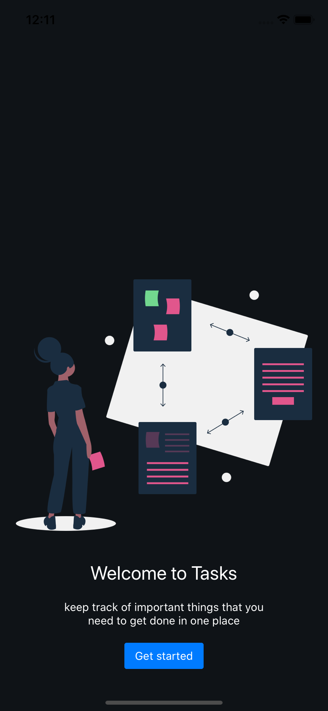
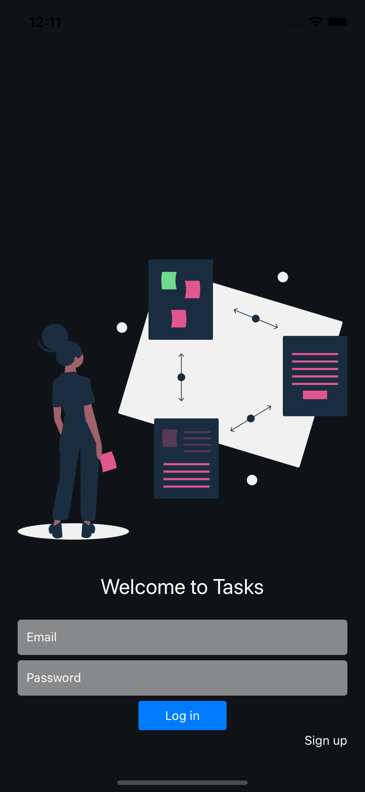
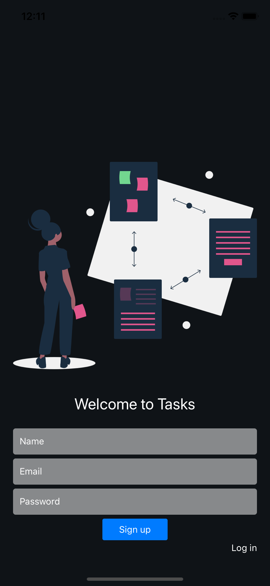
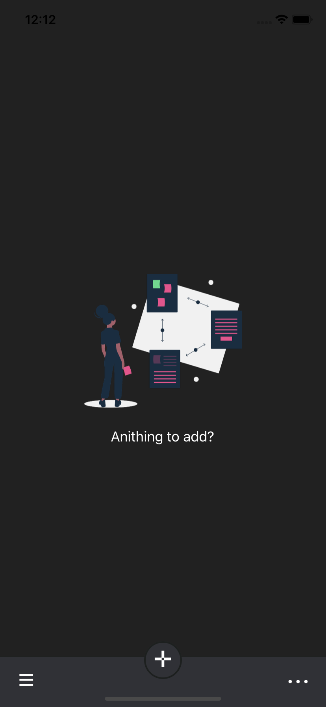
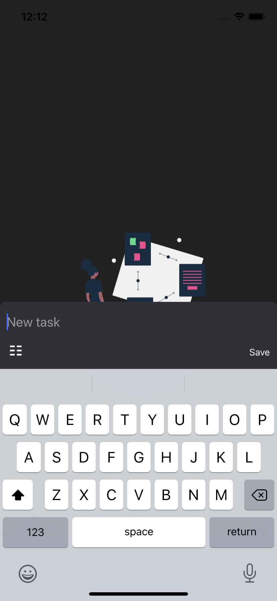
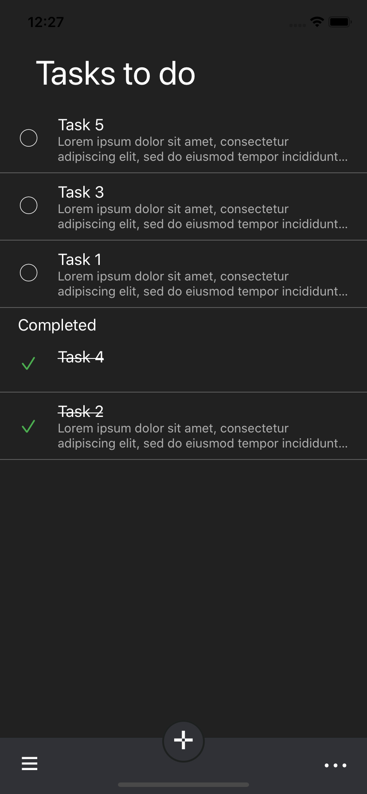

# Tasks

## Installation

If you want to test the app on a simulator running locally:

`git clone https://github.com/anibalajt/Tasks.git`

```bash
$ cd Tasks

$ yarn install or npm install

$ cd ios

$ pod install

$ cd ..

$ react-native run-ios
```

## Adding firebase credentials

This step requires us to create a new project in [the Firebase console](https://console.firebase.google.com/).

After creating a new project on the dashboard page select add Firebase to iOS app. This will show you the steps to add credentials to iOS like below.


It consists of a few steps :

  Download the GoogleService-info.plist file and put it inside the iOS folder within your project.


Initialize Firebase



